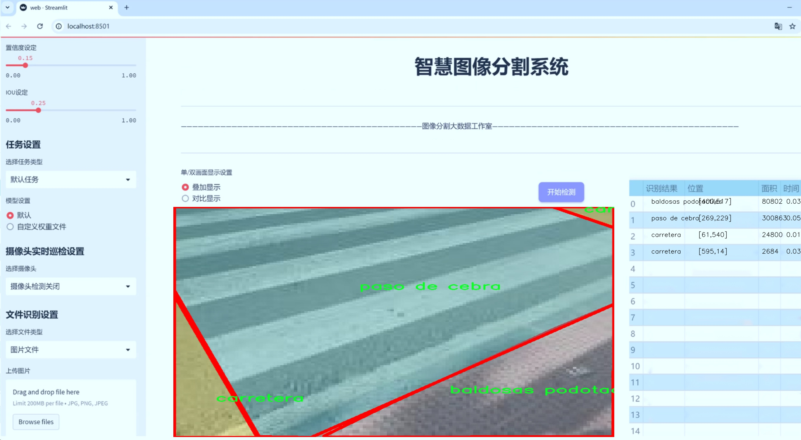
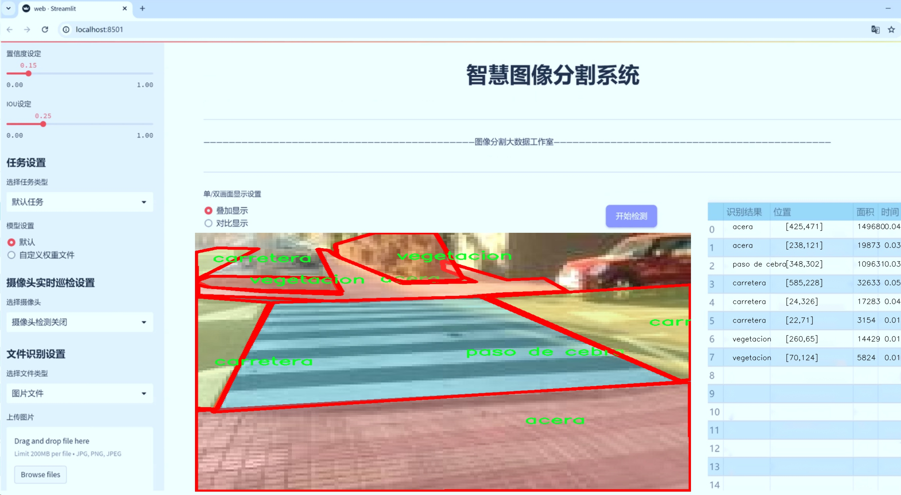
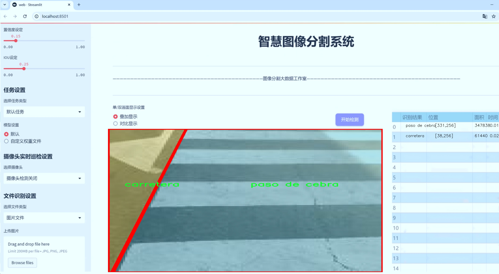
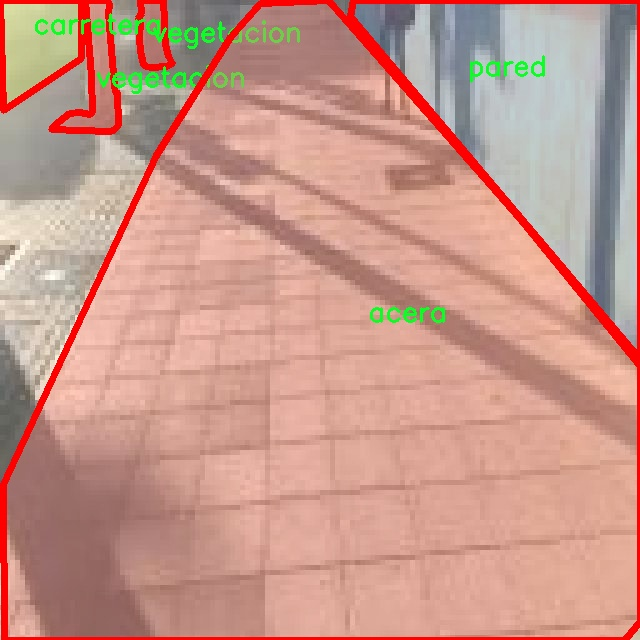
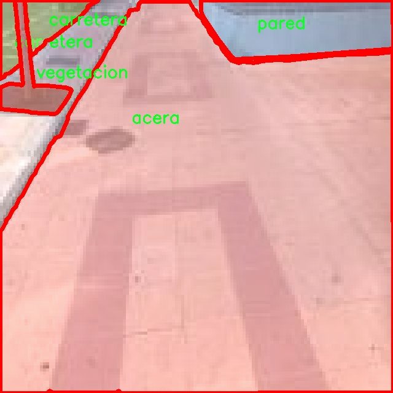
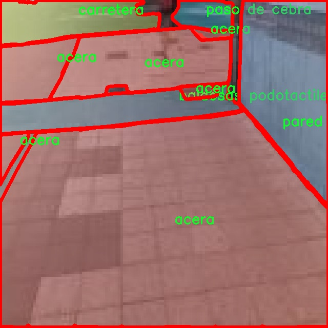
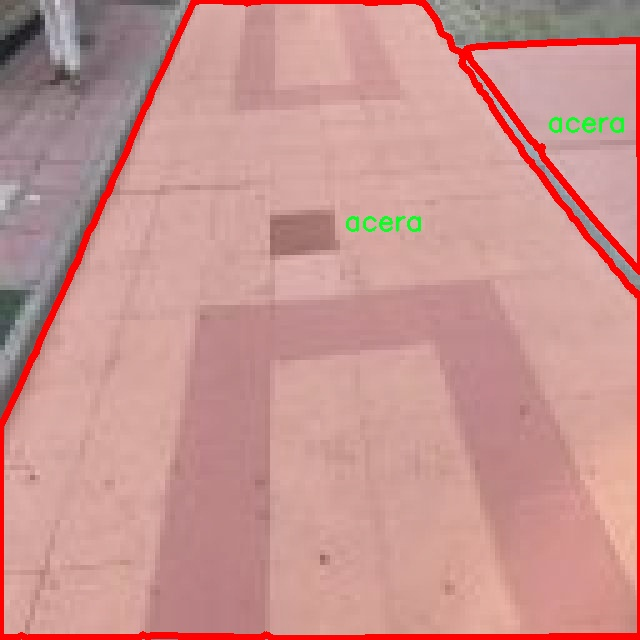
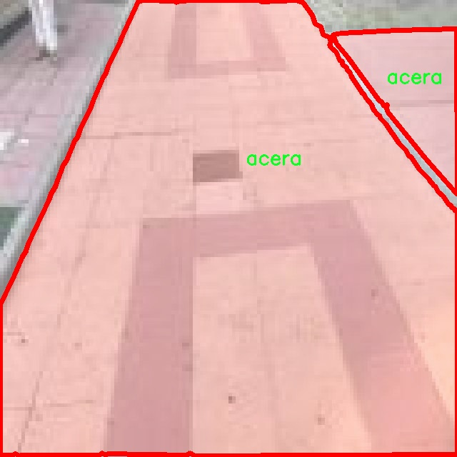

# 城市道路场景分割系统源码＆数据集分享
 [yolov8-seg-KernelWarehouse＆yolov8-seg-SPPF-LSKA等50+全套改进创新点发刊_一键训练教程_Web前端展示]

### 1.研究背景与意义

项目参考[ILSVRC ImageNet Large Scale Visual Recognition Challenge](https://gitee.com/YOLOv8_YOLOv11_Segmentation_Studio/projects)

项目来源[AAAI Global Al lnnovation Contest](https://kdocs.cn/l/cszuIiCKVNis)

研究背景与意义

随着城市化进程的加快，城市道路场景的复杂性不断增加，如何有效地进行城市道路场景的分割与理解，成为了智能交通系统、自动驾驶技术以及城市管理的重要研究课题。近年来，深度学习技术的迅猛发展为图像分割任务提供了新的解决方案，尤其是基于卷积神经网络（CNN）的目标检测与分割模型，如YOLO（You Only Look Once）系列，因其高效性和实时性而备受关注。YOLOv8作为该系列的最新版本，进一步提升了模型的精度和速度，适用于复杂的城市环境。然而，传统的YOLOv8模型在处理城市道路场景时，仍然面临着分割精度不足、对小物体识别能力弱等问题。因此，基于改进YOLOv8的城市道路场景分割系统的研究显得尤为重要。

本研究的核心在于利用一个包含2500张图像的特定数据集，该数据集涵盖了七个类别，包括人行道（acera）、盲道砖（baldosas podotactiles）、长椅（banco）、道路（carretera）、墙壁（pared）、斑马线（paso de cebra）和植被（vegetacion）。这些类别的选择不仅反映了城市道路场景的多样性，也为模型的训练提供了丰富的样本。这些样本在不同的光照、天气和视角条件下，展示了城市道路的复杂性和多变性。通过对这些数据的深入分析与处理，能够有效提升YOLOv8在城市道路场景分割中的表现，尤其是在小物体和边缘物体的识别能力上。

此外，城市道路场景的分割不仅仅是一个技术问题，更是社会发展的需求。随着智能交通系统的推广，城市管理者需要准确的道路信息来优化交通流量、提高行车安全和提升市民的出行体验。通过改进YOLOv8模型，能够实现对城市道路场景的实时监测与分析，为城市管理提供数据支持。同时，该研究也将为自动驾驶技术的发展奠定基础，帮助自动驾驶系统更好地理解和适应复杂的城市环境，从而提高行车安全性和可靠性。

综上所述，基于改进YOLOv8的城市道路场景分割系统的研究，不仅具有重要的学术价值，还有着广泛的应用前景。通过对城市道路场景的深入理解与精准分割，能够为智能交通、城市管理及自动驾驶等领域提供强有力的技术支持，推动相关领域的进一步发展。希望本研究能够为城市道路场景的智能化管理贡献一份力量，同时也为后续的研究提供参考与借鉴。

### 2.图片演示







##### 注意：由于此博客编辑较早，上面“2.图片演示”和“3.视频演示”展示的系统图片或者视频可能为老版本，新版本在老版本的基础上升级如下：（实际效果以升级的新版本为准）

  （1）适配了YOLOV8的“目标检测”模型和“实例分割”模型，通过加载相应的权重（.pt）文件即可自适应加载模型。

  （2）支持“图片识别”、“视频识别”、“摄像头实时识别”三种识别模式。

  （3）支持“图片识别”、“视频识别”、“摄像头实时识别”三种识别结果保存导出，解决手动导出（容易卡顿出现爆内存）存在的问题，识别完自动保存结果并导出到tempDir中。

  （4）支持Web前端系统中的标题、背景图等自定义修改，后面提供修改教程。

  另外本项目提供训练的数据集和训练教程,暂不提供权重文件（best.pt）,需要您按照教程进行训练后实现图片演示和Web前端界面演示的效果。

### 3.视频演示

[3.1 视频演示](https://www.bilibili.com/video/BV1WD15YNE7K/)

### 4.数据集信息展示

##### 4.1 本项目数据集详细数据（类别数＆类别名）

nc: 7
names: ['acera', 'baldosas podotactiles', 'banco', 'carretera', 'pared', 'paso de cebra', 'vegetacion']


##### 4.2 本项目数据集信息介绍

数据集信息展示

在本研究中，我们采用了名为“prueba YOLO”的数据集，以支持对城市道路场景分割系统的训练，特别是针对改进YOLOv8-seg模型的优化。该数据集的设计旨在为城市环境中的物体检测和分割提供丰富的样本，确保模型能够在复杂的实际场景中表现出色。数据集包含七个类别，分别是“acera”（人行道）、“baldosas podotactiles”（触觉砖）、“banco”（长椅）、“carretera”（道路）、“pared”（墙）、“paso de cebra”（斑马线）和“vegetacion”（植被）。这些类别的选择充分考虑了城市道路场景的多样性和复杂性，使得模型在实际应用中能够准确识别和分割不同的物体。

“prueba YOLO”数据集的构建基于对城市环境的深入分析，涵盖了人行道、道路、长椅等常见元素，这些元素在城市交通和行人活动中扮演着重要角色。人行道和斑马线的准确识别对于行人安全至关重要，而道路的检测则是确保交通流畅和安全的基础。触觉砖的存在则为视障人士提供了必要的导航支持，长椅则是城市公共空间的重要组成部分，提供了休息和社交的场所。墙体的检测有助于理解城市建筑的布局和结构，而植被的识别则为城市生态环境的评估提供了数据支持。

数据集中的每个类别都经过精心标注，确保了高质量的训练数据。通过使用高分辨率的图像和多样化的拍摄角度，数据集不仅增强了模型的泛化能力，还提高了其在不同光照和天气条件下的表现。为了提高模型的鲁棒性，数据集中还包含了不同城市环境下的样本，涵盖了繁忙的市中心、宁静的住宅区以及公园等多种场景。这种多样性使得模型在实际应用中能够更好地适应不同的环境变化。

在数据预处理阶段，我们对图像进行了标准化处理，以确保输入数据的一致性。同时，为了提高模型的训练效率，我们采用了数据增强技术，如随机裁剪、旋转和颜色调整等，以生成更多的训练样本。这些技术不仅增加了数据集的规模，还帮助模型学习到更具代表性的特征，从而提升了分割精度。

通过对“prueba YOLO”数据集的深入分析和有效利用，我们期望能够显著提升YOLOv8-seg模型在城市道路场景分割任务中的表现。该数据集的丰富性和多样性为模型的训练提供了坚实的基础，使其能够在复杂的城市环境中实现高效、准确的物体分割。这一研究不仅有助于推动智能交通系统的发展，也为未来的城市规划和管理提供了重要的数据支持。











### 5.全套项目环境部署视频教程（零基础手把手教学）

[5.1 环境部署教程链接（零基础手把手教学）](https://www.bilibili.com/video/BV1jG4Ve4E9t/?vd_source=bc9aec86d164b67a7004b996143742dc)


[5.2 安装Python虚拟环境创建和依赖库安装视频教程链接（零基础手把手教学）](https://www.bilibili.com/video/BV1nA4VeYEze/?vd_source=bc9aec86d164b67a7004b996143742dc)

### 6.手把手YOLOV8-seg训练视频教程（零基础小白有手就能学会）

[6.1 手把手YOLOV8-seg训练视频教程（零基础小白有手就能学会）](https://www.bilibili.com/video/BV1cA4VeYETe/?vd_source=bc9aec86d164b67a7004b996143742dc)


按照上面的训练视频教程链接加载项目提供的数据集，运行train.py即可开始训练



     Epoch   gpu_mem       box       obj       cls    labels  img_size
     1/200     0G   0.01576   0.01955  0.007536        22      1280: 100%|██████████| 849/849 [14:42<00:00,  1.04s/it]
               Class     Images     Labels          P          R     mAP@.5 mAP@.5:.95: 100%|██████████| 213/213 [01:14<00:00,  2.87it/s]
                 all       3395      17314      0.994      0.957      0.0957      0.0843

     Epoch   gpu_mem       box       obj       cls    labels  img_size
     2/200     0G   0.01578   0.01923  0.007006        22      1280: 100%|██████████| 849/849 [14:44<00:00,  1.04s/it]
               Class     Images     Labels          P          R     mAP@.5 mAP@.5:.95: 100%|██████████| 213/213 [01:12<00:00,  2.95it/s]
                 all       3395      17314      0.996      0.956      0.0957      0.0845

     Epoch   gpu_mem       box       obj       cls    labels  img_size
     3/200     0G   0.01561    0.0191  0.006895        27      1280: 100%|██████████| 849/849 [10:56<00:00,  1.29it/s]
               Class     Images     Labels          P          R     mAP@.5 mAP@.5:.95: 100%|███████   | 187/213 [00:52<00:00,  4.04it/s]
                 all       3395      17314      0.996      0.957      0.0957      0.0845


### 7.50+种全套YOLOV8-seg创新点代码加载调参视频教程（一键加载写好的改进模型的配置文件）

[7.1 50+种全套YOLOV8-seg创新点代码加载调参视频教程（一键加载写好的改进模型的配置文件）](https://www.bilibili.com/video/BV1Hw4VePEXv/?vd_source=bc9aec86d164b67a7004b996143742dc)

### 8.YOLOV8-seg图像分割算法原理

原始YOLOV8-seg算法原理

YOLO（You Only Look Once）系列算法自诞生以来，便以其高效的目标检测能力而受到广泛关注。YOLOv8-seg作为该系列的最新版本，继承并发展了前几代算法的优点，同时在网络结构和训练策略上进行了多项创新，尤其是在语义分割任务中的应用。YOLOv8-seg的设计理念是将目标检测与分割任务相结合，以实现更高精度的物体识别和边界定位。

YOLOv8-seg的网络结构主要由输入层、主干网络、特征增强网络和检测头组成。输入层负责接收图像数据，经过一系列预处理后，将其传递给主干网络。主干网络采用了CSP（Cross Stage Partial）结构，这种结构通过分割和合并特征图的方式，增强了特征提取的能力，同时保持了计算效率。YOLOv8-seg的主干网络不仅能够提取丰富的特征信息，还能有效地减轻模型的计算负担，为后续的特征增强和检测任务奠定了基础。

在特征增强网络方面，YOLOv8-seg引入了PAN-FPN（Path Aggregation Network - Feature Pyramid Network）结构。这一结构通过多层次的特征融合，增强了不同尺度特征的表达能力。PAN-FPN通过自下而上的路径聚合特征，使得网络能够更好地捕捉到目标的上下文信息，尤其是在处理复杂场景时，能够有效提升模型的鲁棒性和准确性。此外，YOLOv8-seg还采用了C2f模块替代了传统的C3模块，C2f模块在设计上引入了更多的残差连接，促进了梯度的流动，从而提升了模型的训练效果和收敛速度。

YOLOv8-seg的检测头部分则采用了解耦合的设计理念，将分类和回归任务分为两个独立的分支。这种解耦合的结构使得每个分支能够专注于自身的任务，从而提高了分类和定位的精度。在传统的YOLO模型中，分类和回归任务往往共享同一套特征，这在一定程度上限制了模型的性能。通过解耦合，YOLOv8-seg能够更有效地处理复杂场景下的目标检测和分割任务。

值得一提的是，YOLOv8-seg采用了Anchor-Free的目标检测方法。这一方法的核心在于不再依赖于预定义的锚框，而是直接通过回归的方式预测目标的位置和大小。这种设计极大地简化了模型的训练过程，同时提高了模型对不同尺度和形状目标的适应能力。通过直接预测目标的中心点，YOLOv8-seg能够更快地聚焦于目标区域，提升了检测的速度和准确性。

在训练过程中，YOLOv8-seg引入了动态的任务对齐学习（Task Alignment Learning）策略，以优化样本分配。这一策略通过分析分类分数和IOU（Intersection over Union）的高次幂乘积，帮助模型更好地理解正负样本之间的关系，从而提高了训练的效率和效果。此外，YOLOv8-seg在训练的最后阶段关闭了马赛克数据增强，以避免对模型学习真实数据分布的干扰，这一策略在一定程度上提升了模型的泛化能力。

在损失函数的设计上，YOLOv8-seg采用了BCELoss作为分类损失，DFLLoss和CIoULoss作为回归损失。这种多重损失函数的设计旨在全面提升模型的检测性能，确保在不同任务下都能取得良好的效果。BCELoss通过对分类结果的二元交叉熵进行优化，确保模型在分类任务上的准确性；而DFLLoss和CIoULoss则分别针对边界框的回归任务进行优化，确保模型能够准确地预测目标的位置和大小。

综上所述，YOLOv8-seg通过其创新的网络结构、解耦合的检测头、Anchor-Free的检测方法以及动态的任务对齐学习策略，极大地提升了目标检测和分割的性能。该算法不仅在精度上取得了显著提升，同时也在计算效率上表现出色，适合于实时检测的应用场景。随着YOLOv8-seg的不断发展和优化，其在各类视觉任务中的应用潜力将更加广阔，值得研究者和工程师们深入探索和实践。


### 9.系统功能展示（检测对象为举例，实际内容以本项目数据集为准）

图9.1.系统支持检测结果表格显示

  图9.2.系统支持置信度和IOU阈值手动调节

  图9.3.系统支持自定义加载权重文件best.pt(需要你通过步骤5中训练获得)

  图9.4.系统支持摄像头实时识别

  图9.5.系统支持图片识别

  图9.6.系统支持视频识别

  图9.7.系统支持识别结果文件自动保存

  图9.8.系统支持Excel导出检测结果数据


### 10.50+种全套YOLOV8-seg创新点原理讲解（非科班也可以轻松写刊发刊，V11版本正在科研待更新）

#### 10.1 由于篇幅限制，每个创新点的具体原理讲解就不一一展开，具体见下列网址中的创新点对应子项目的技术原理博客网址【Blog】：


[10.1 50+种全套YOLOV8-seg创新点原理讲解链接](https://gitee.com/qunmasj/good)

#### 10.2 部分改进模块原理讲解(完整的改进原理见上图和技术博客链接)【如果此小节的图加载失败可以通过CSDN或者Github搜索该博客的标题访问原始博客，原始博客图片显示正常】

### YOLOv8简介
YOLOv8是一种目标检测模型，是基于YOLO (You Only Look Once)系列算法发展而来的最新版本。它的核心思想是将目标检测任务转化为一个回归问题，通过单次前向传播即可直接预测出图像中的多个目标的位置和类别。
YOLOv8的网络结构采用了Darknet作为其主干网络，主要由卷积层和池化层构成。与之前的版本相比，YOLOv8在网络结构上进行了改进，引入了更多的卷积层和残差模块，以提高模型的准确性和鲁棒性。
YOLOv8采用了一种特征金字塔网络(Feature Pyramid Network,FPN)的结构，通过在不同层级上融合多尺度的特征信息，可以对不同尺度的目标进行有效的检测。此外，YOLOv8还引入了一种自适应感知域(Adaptive Anchors
的机制，通过自适应地学习目标的尺度和
长宽比，提高了模型对于不同尺度和形状目标的检测效果。
总体来说，YOLOv8结构模型综合了多个先进的目标检测技术，在保证检测速度的同时提升了检测精度和鲁棒性，被广泛应用于实时目标检测任务中。


#### yolov8网络模型结构图

YOLOv8 (You Only Look Once version 8)是一种目标检测算法，它在实时场景下可以快速准确地检测图像中的目标。
YOLOv8的网络模型结构基于Darknet框架，由一系列卷积层、池化层和全连接层组成。主要包含以下几个组件:
1.输入层:接收输入图像。
2.卷积层:使用不同尺寸的卷积核来提取图像特征。
3.残差块(Residual blocks):通过使用跳跃连接(skip connections）来解决梯度消失问题，使得网络更容易训练。
4.上采样层(Upsample layers):通过插值操作将特征图的尺寸放大，以便在不同尺度上进行目标检测。
5.池化层:用于减小特征图的尺寸，同时保留重要的特征。
6.1x1卷积层:用于降低通道数，减少网络参数量。
7.3x3卷积层:用于进—步提取和组合特征。
8.全连接层:用于最后的目标分类和定位。
YOLOv8的网络结构采用了多个不同尺度的特征图来检测不同大小的目标，从而提高了目标检测的准确性和多尺度性能。
请注意，YOLOv8网络模型结构图的具体细节可能因YOLO版本和实现方式而有所不同。


#### yolov8模型结构
YOLOv8模型是一种目标检测模型，其结构是基于YOLOv3模型进行改进的。模型结构可以分为主干网络和检测头两个部分。
主干网络是一种由Darknet-53构成的卷积神经网络。Darknet-53是一个经过多层卷积和残差连接构建起来的深度神经网络。它能够提取图像的特征信息，并将这些信息传递给检测头。
检测头是YOLOv8的关键部分，它负责在图像中定位和识别目标。检测头由一系列卷积层和全连接层组成。在每个检测头中，会生成一组锚框，并针对每个锚框预测目标的类别和位置信息。
YOLOv8模型使用了预训练的权重，其中在COCO数据集上进行了训练。这意味着该模型已经通过大规模数据集的学习，具有一定的目标检测能力。

### RT-DETR骨干网络HGNetv2简介
#### RT-DETR横空出世
前几天被百度的RT-DETR刷屏，参考该博客提出的目标检测新范式对原始DETR的网络结构进行了调整和优化，以提高计算速度和减小模型大小。这包括使用更轻量级的基础网络和调整Transformer结构。并且，摒弃了nms处理的detr结构与传统的物体检测方法相比，不仅训练是端到端的，检测也能端到端，这意味着整个网络在训练过程中一起进行优化，推理过程不需要昂贵的后处理代价，这有助于提高模型的泛化能力和性能。


当然，人们对RT-DETR之所以产生浓厚的兴趣，我觉得大概率还是对YOLO系列审美疲劳了，就算是出到了YOLO10086，我还是只想用YOLOv5和YOLOv7的框架来魔改做业务。。

#### 初识HGNet
看到RT-DETR的性能指标，发现指标最好的两个模型backbone都是用的HGNetv2，毫无疑问，和当时的picodet一样，骨干都是使用百度自家的网络。初识HGNet的时候，当时是参加了第四届百度网盘图像处理大赛，文档图像方向识别专题赛道，简单来说，就是使用分类网络对一些文档截图或者图片进行方向角度分类。


当时的方案并没有那么快定型，通常是打榜过程发现哪个网络性能好就使用哪个网络做魔改，而且木有显卡，只能蹭Ai Studio的平台，不过v100一天8小时的实验时间有点短，这也注定了大模型用不了。 

流水的模型，铁打的炼丹人，最后发现HGNet-tiny各方面指标都很符合我们的预期，后面就一直围绕它魔改。当然，比赛打榜是目的，学习才是享受过程，当时看到效果还可以，便开始折腾起了HGNet的网络架构，我们可以看到，PP-HGNet 针对 GPU 设备，对目前 GPU 友好的网络做了分析和归纳，尽可能多的使用 3x3 标准卷积（计算密度最高），PP-HGNet是由多个HG-Block组成，细节如下：


ConvBNAct是啥？简单聊一聊，就是Conv+BN+Act，CV Man应该最熟悉不过了：
```python
class ConvBNAct(TheseusLayer):
    def __init__(self,
                 in_channels,
                 out_channels,
                 kernel_size,
                 stride,
                 groups=1,
                 use_act=True):
        super().__init__()
        self.use_act = use_act
        self.conv = Conv2D(
            in_channels,
            out_channels,
            kernel_size,
            stride,
            padding=(kernel_size - 1) // 2,
            groups=groups,
            bias_attr=False)
        self.bn = BatchNorm2D(
            out_channels,
            weight_attr=ParamAttr(regularizer=L2Decay(0.0)),
            bias_attr=ParamAttr(regularizer=L2Decay(0.0)))
        if self.use_act:
            self.act = ReLU()
 
    def forward(self, x):
        x = self.conv(x)
        x = self.bn(x)
        if self.use_act:
            x = self.act(x)
        return x 
```
且标准卷积的数量随层数深度增加而增多，从而得到一个有利于 GPU 推理的骨干网络，同样速度下，精度也超越其他 CNN ，性价比也优于ViT-base模型。


另外，我们可以看到：

PP-HGNet 的第一层由channel为96的Stem模块构成，目的是为了减少参数量和计算量。PP-HGNet

Tiny的整体结构由四个HG Stage构成，而每个HG Stage主要由包含大量标准卷积的HG Block构成。

PP-HGNet的第三到第五层使用了使用了可学习的下采样层（LDS Layer），该层group为输入通道数，可达到降参降计算量的作用，且Tiny模型仅包含三个LDS Layer，并不会对GPU的利用率造成较大影响.

PP-HGNet的激活函数为Relu，常数级操作可保证该模型在硬件上的推理速度。

### 11.项目核心源码讲解（再也不用担心看不懂代码逻辑）

#### 11.1 ultralytics\nn\modules\__init__.py

以下是对给定代码的核心部分进行提炼和详细注释的结果：

```python
# Ultralytics YOLO 🚀, AGPL-3.0 license
"""
Ultralytics模块的导入示例。

示例：
    使用Netron可视化模块。
    ```python
    from ultralytics.nn.modules import *
    import torch
    import os

    # 创建一个形状为(1, 128, 40, 40)的张量，表示一个批次的128通道特征图，大小为40x40
    x = torch.ones(1, 128, 40, 40)
    
    # 创建一个卷积层，输入和输出通道均为128
    m = Conv(128, 128)
    
    # 定义导出模型的文件名
    f = f'{m._get_name()}.onnx'
    
    # 将模型导出为ONNX格式
    torch.onnx.export(m, x, f)
    
    # 使用onnxsim优化ONNX模型并打开文件
    os.system(f'onnxsim {f} {f} && open {f}')
    ```
"""

# 从其他模块导入必要的组件
from .block import *        # 导入模块中的块（block）定义
from .conv import *         # 导入卷积层（Conv）定义
from .head import *         # 导入头部（head）定义，通常用于模型的输出部分
from .transformer import *   # 导入变换器（transformer）定义，可能用于特征处理或注意力机制
```

### 代码分析和注释说明：

1. **模块导入**：
   - `from .block import *`：导入当前包中的所有块定义，块通常是构建神经网络的基本单元。
   - `from .conv import *`：导入卷积层的定义，卷积层是卷积神经网络（CNN）的核心组件。
   - `from .head import *`：导入头部定义，头部通常用于模型的输出部分，可能包括分类或回归的层。
   - `from .transformer import *`：导入变换器定义，变换器可能用于处理输入特征或实现注意力机制。

2. **示例代码**：
   - 示例代码展示了如何使用PyTorch创建一个简单的卷积层，并将其导出为ONNX格式。ONNX（Open Neural Network Exchange）是一种开放格式，用于表示深度学习模型，便于在不同框架之间共享和部署模型。
   - `torch.ones(1, 128, 40, 40)`：创建一个形状为(1, 128, 40, 40)的张量，表示一个批次的128通道特征图，大小为40x40。
   - `Conv(128, 128)`：创建一个卷积层，输入和输出通道均为128。
   - `torch.onnx.export(m, x, f)`：将模型`m`和输入张量`x`导出为ONNX格式，文件名为`f`。
   - `os.system(f'onnxsim {f} {f} && open {f}')`：使用onnxsim工具优化导出的ONNX模型，并打开该文件。

以上就是对代码的核心部分和详细注释的分析。

这个文件是Ultralytics YOLO项目中的一个模块初始化文件，遵循AGPL-3.0许可证。文件的主要作用是导入和组织与神经网络相关的模块，以便在其他地方使用。

文件开头的注释部分简要介绍了Ultralytics模块，并提供了一个示例，说明如何使用这些模块进行可视化。示例代码中，首先从`ultralytics.nn.modules`导入所有模块，然后使用PyTorch创建一个形状为(1, 128, 40, 40)的张量，表示一个批次的128通道、40x40的特征图。接着，创建了一个卷积层实例`m`，该层的输入和输出通道均为128。示例中还展示了如何将这个卷积层导出为ONNX格式，并使用`onnxsim`工具进行简化，最后打开生成的ONNX文件。

在文件的最后部分，使用相对导入的方式引入了其他几个模块，包括`block`、`conv`、`head`和`transformer`。这些模块可能包含了构建神经网络所需的各种组件，如卷积层、网络头部和变换器等。

总体而言，这个文件是Ultralytics YOLO项目中神经网络模块的入口，方便用户在其他代码中使用和扩展这些功能。

#### 11.2 ultralytics\nn\modules\utils.py

以下是经过简化并添加详细中文注释的核心代码部分：

```python
import torch
import torch.nn.functional as F

def multi_scale_deformable_attn_pytorch(value: torch.Tensor, value_spatial_shapes: torch.Tensor,
                                        sampling_locations: torch.Tensor,
                                        attention_weights: torch.Tensor) -> torch.Tensor:
    """
    多尺度可变形注意力机制。

    参数:
        value: 输入特征图，形状为 (bs, C, num_heads, embed_dims)
        value_spatial_shapes: 特征图的空间形状，形状为 (num_levels, 2)
        sampling_locations: 采样位置，形状为 (bs, num_queries, num_heads, num_levels, num_points, 2)
        attention_weights: 注意力权重，形状为 (bs, num_heads, num_queries, num_levels, num_points)

    返回:
        output: 输出特征图，形状为 (bs, num_queries, num_heads * embed_dims)
    """

    # 获取输入的形状信息
    bs, _, num_heads, embed_dims = value.shape
    _, num_queries, _, num_levels, num_points, _ = sampling_locations.shape

    # 将输入特征图根据空间形状分割成多个层次
    value_list = value.split([H_ * W_ for H_, W_ in value_spatial_shapes], dim=1)

    # 将采样位置转换到[-1, 1]范围
    sampling_grids = 2 * sampling_locations - 1
    sampling_value_list = []

    # 遍历每个层次
    for level, (H_, W_) in enumerate(value_spatial_shapes):
        # 对当前层的特征图进行处理
        value_l_ = (value_list[level].flatten(2).transpose(1, 2).reshape(bs * num_heads, embed_dims, H_, W_))

        # 获取当前层的采样网格
        sampling_grid_l_ = sampling_grids[:, :, :, level].transpose(1, 2).flatten(0, 1)

        # 使用双线性插值进行采样
        sampling_value_l_ = F.grid_sample(value_l_,
                                          sampling_grid_l_,
                                          mode='bilinear',
                                          padding_mode='zeros',
                                          align_corners=False)
        sampling_value_list.append(sampling_value_l_)

    # 转换注意力权重的形状
    attention_weights = attention_weights.transpose(1, 2).reshape(bs * num_heads, 1, num_queries,
                                                                  num_levels * num_points)

    # 计算最终输出
    output = ((torch.stack(sampling_value_list, dim=-2).flatten(-2) * attention_weights).sum(-1).view(
        bs, num_heads * embed_dims, num_queries))

    return output.transpose(1, 2).contiguous()  # 返回形状为 (bs, num_queries, num_heads * embed_dims) 的输出
```

### 代码说明：
1. **函数定义**：`multi_scale_deformable_attn_pytorch` 是实现多尺度可变形注意力机制的核心函数。
2. **参数说明**：
   - `value`：输入特征图，包含多个头和嵌入维度。
   - `value_spatial_shapes`：特征图的空间形状，帮助确定每个层的高和宽。
   - `sampling_locations`：采样位置，用于确定在特征图上进行采样的具体位置。
   - `attention_weights`：注意力权重，决定了各个采样点对最终输出的贡献。
3. **核心逻辑**：
   - 将输入特征图根据空间形状分割为多个层次。
   - 将采样位置转换到[-1, 1]范围，以适应 `grid_sample` 函数的要求。
   - 对每个层次的特征图进行双线性插值采样，得到对应的采样值。
   - 最后，利用注意力权重对采样值进行加权求和，得到最终的输出特征图。

这个程序文件是Ultralytics YOLO项目中的一个工具模块，主要用于实现一些深度学习中常用的功能和操作。文件中包含了多个函数，这些函数主要涉及模块的克隆、参数初始化、逆sigmoid函数的计算以及多尺度可变形注意力机制的实现。

首先，文件导入了一些必要的库，包括`copy`、`math`、`numpy`和`torch`等，这些库提供了基础的数学运算和深度学习所需的功能。接着，定义了一个`_get_clones`函数，该函数用于根据给定的模块创建多个克隆模块，返回一个`nn.ModuleList`，这在构建深度学习模型时非常有用，尤其是在需要重复使用相同结构的情况下。

接下来，`bias_init_with_prob`函数用于根据给定的先验概率初始化卷积或全连接层的偏置值。它通过计算对数几率来实现这一点，这种初始化方式可以帮助模型更快地收敛。

`linear_init_`函数则用于初始化线性模块的权重和偏置。它使用均匀分布来初始化权重和偏置，确保权重在一个合理的范围内，从而提高模型的训练效果。

`inverse_sigmoid`函数实现了逆sigmoid函数的计算。该函数首先将输入张量限制在0到1之间，然后计算其逆sigmoid值。这在某些情况下可以用于处理模型输出的概率值。

最后，`multi_scale_deformable_attn_pytorch`函数实现了多尺度可变形注意力机制。该函数接受多个输入参数，包括值张量、空间形状、采样位置和注意力权重。函数内部首先对输入进行处理，将其分割为不同的尺度，然后通过`F.grid_sample`函数进行双线性插值采样，最后结合注意力权重计算输出。这个过程涉及到对张量的维度变换和重组，确保最终输出的形状符合预期。

总体来说，这个模块提供了一些基础的工具函数，旨在支持YOLO模型的构建和训练，尤其是在处理注意力机制和参数初始化方面。

#### 11.3 ultralytics\models\nas\val.py

以下是代码中最核心的部分，并附上详细的中文注释：

```python
import torch
from ultralytics.utils import ops

class NASValidator:
    """
    Ultralytics YOLO NAS 验证器，用于目标检测。

    该类用于对 YOLO NAS 模型生成的原始预测结果进行后处理。
    它执行非极大值抑制（NMS），以去除重叠和低置信度的框，最终生成最终检测结果。
    """

    def postprocess(self, preds_in):
        """对预测输出应用非极大值抑制（NMS）。"""
        # 将预测结果中的边界框从 xyxy 格式转换为 xywh 格式
        boxes = ops.xyxy2xywh(preds_in[0][0])
        
        # 将边界框和置信度合并，并调整维度顺序
        preds = torch.cat((boxes, preds_in[0][1]), -1).permute(0, 2, 1)
        
        # 应用非极大值抑制，去除重叠的框
        return ops.non_max_suppression(preds,
                                       self.args.conf,  # 置信度阈值
                                       self.args.iou,   # IoU 阈值
                                       labels=self.lb,  # 可选的多标签 NMS 张量
                                       multi_label=False,  # 是否使用多标签
                                       agnostic=self.args.single_cls,  # 是否使用类别无关的 NMS
                                       max_det=self.args.max_det,  # 最大检测框数量
                                       max_time_img=0.5)  # 每张图像的最大处理时间
```

### 代码注释说明：
1. **类定义**：`NASValidator` 类用于处理 YOLO NAS 模型的预测结果，主要功能是执行非极大值抑制（NMS）。
2. **postprocess 方法**：该方法接收原始预测结果 `preds_in`，并对其进行后处理。
   - **边界框转换**：使用 `ops.xyxy2xywh` 将边界框从 `xyxy` 格式（左上角和右下角坐标）转换为 `xywh` 格式（中心坐标和宽高）。
   - **合并预测结果**：将边界框和对应的置信度合并为一个张量，并调整维度顺序，以便后续处理。
   - **非极大值抑制**：调用 `ops.non_max_suppression` 方法，去除重叠和低置信度的框，最终返回处理后的检测结果。该方法的参数包括置信度阈值、IoU 阈值等配置选项。

这个程序文件是Ultralytics YOLO模型的一部分，主要用于YOLO NAS（Neural Architecture Search）模型的目标检测后处理。文件中定义了一个名为`NASValidator`的类，它继承自`DetectionValidator`类，专门用于处理YOLO NAS模型生成的原始预测结果。

在类的文档字符串中，首先介绍了`NASValidator`的功能，它的主要任务是对YOLO NAS模型的原始预测结果进行后处理，具体包括执行非极大值抑制（Non-Maximum Suppression, NMS），以去除重叠和低置信度的边界框，从而生成最终的检测结果。

该类有两个主要属性：`args`和`lb`。`args`是一个命名空间对象，包含了各种后处理配置，例如置信度和IoU（Intersection over Union）阈值。`lb`是一个可选的张量，用于多标签的非极大值抑制。

在使用示例中，首先从`ultralytics`库中导入`NAS`类，然后创建一个YOLO NAS模型的实例。接着，通过模型的`validator`属性获取`NASValidator`的实例，并假设已经获得了原始预测结果`raw_preds`，最后调用`postprocess`方法对这些预测结果进行处理，得到最终的预测结果。

`postprocess`方法是`NASValidator`类的核心功能，它接受原始预测结果作为输入，并应用非极大值抑制。具体步骤包括将输入的预测框从xyxy格式转换为xywh格式，然后将边界框和相应的置信度合并，最后调用`ops.non_max_suppression`函数进行非极大值抑制，返回最终的检测结果。

总的来说，这个文件的主要功能是为YOLO NAS模型提供一个有效的后处理工具，以提高目标检测的准确性和可靠性。该类通常不会被直接实例化，而是在`NAS`类内部使用。

#### 11.4 ultralytics\data\build.py

以下是代码中最核心的部分，并附上详细的中文注释：

```python
import os
import random
import numpy as np
import torch
from torch.utils.data import dataloader, distributed
from .dataset import YOLODataset
from .utils import PIN_MEMORY

class InfiniteDataLoader(dataloader.DataLoader):
    """
    无限数据加载器，重用工作线程。

    该类使用与普通 DataLoader 相同的语法。
    """

    def __init__(self, *args, **kwargs):
        """初始化无限数据加载器，继承自 DataLoader。"""
        super().__init__(*args, **kwargs)
        # 使用 _RepeatSampler 来无限循环数据
        object.__setattr__(self, 'batch_sampler', _RepeatSampler(self.batch_sampler))
        self.iterator = super().__iter__()

    def __len__(self):
        """返回批次采样器的长度。"""
        return len(self.batch_sampler.sampler)

    def __iter__(self):
        """创建一个无限重复的采样器。"""
        for _ in range(len(self)):
            yield next(self.iterator)

    def reset(self):
        """
        重置迭代器。

        当我们想在训练过程中修改数据集设置时，这个方法很有用。
        """
        self.iterator = self._get_iterator()


class _RepeatSampler:
    """
    永久重复的采样器。

    参数:
        sampler (Dataset.sampler): 要重复的采样器。
    """

    def __init__(self, sampler):
        """初始化一个对象，使给定的采样器无限重复。"""
        self.sampler = sampler

    def __iter__(self):
        """迭代 'sampler' 并返回其内容。"""
        while True:
            yield from iter(self.sampler)


def seed_worker(worker_id):
    """设置数据加载器工作线程的随机种子。"""
    worker_seed = torch.initial_seed() % 2 ** 32  # 获取当前线程的随机种子
    np.random.seed(worker_seed)  # 设置 numpy 随机种子
    random.seed(worker_seed)  # 设置 random 随机种子


def build_yolo_dataset(cfg, img_path, batch, data, mode='train', rect=False, stride=32):
    """构建 YOLO 数据集。"""
    return YOLODataset(
        img_path=img_path,  # 图像路径
        imgsz=cfg.imgsz,  # 图像大小
        batch_size=batch,  # 批次大小
        augment=mode == 'train',  # 是否进行数据增强
        hyp=cfg,  # 超参数配置
        rect=cfg.rect or rect,  # 是否使用矩形批次
        cache=cfg.cache or None,  # 缓存设置
        single_cls=cfg.single_cls or False,  # 是否使用单类
        stride=int(stride),  # 步幅
        pad=0.0 if mode == 'train' else 0.5,  # 填充
        prefix=colorstr(f'{mode}: '),  # 模式前缀
        use_segments=cfg.task == 'segment',  # 是否使用分割
        use_keypoints=cfg.task == 'pose',  # 是否使用关键点
        classes=cfg.classes,  # 类别
        data=data,  # 数据集信息
        fraction=cfg.fraction if mode == 'train' else 1.0  # 训练时的数据比例
    )


def build_dataloader(dataset, batch, workers, shuffle=True, rank=-1):
    """返回用于训练或验证集的 InfiniteDataLoader 或 DataLoader。"""
    batch = min(batch, len(dataset))  # 确保批次大小不超过数据集大小
    nd = torch.cuda.device_count()  # 获取 CUDA 设备数量
    nw = min([os.cpu_count() // max(nd, 1), batch if batch > 1 else 0, workers])  # 计算工作线程数量
    sampler = None if rank == -1 else distributed.DistributedSampler(dataset, shuffle=shuffle)  # 分布式采样器
    generator = torch.Generator()  # 创建随机数生成器
    generator.manual_seed(6148914691236517205 + RANK)  # 设置随机种子
    return InfiniteDataLoader(dataset=dataset,
                              batch_size=batch,
                              shuffle=shuffle and sampler is None,
                              num_workers=nw,
                              sampler=sampler,
                              pin_memory=PIN_MEMORY,
                              collate_fn=getattr(dataset, 'collate_fn', None),
                              worker_init_fn=seed_worker,
                              generator=generator)  # 返回无限数据加载器


def check_source(source):
    """检查源类型并返回相应的标志值。"""
    webcam, screenshot, from_img, in_memory, tensor = False, False, False, False, False
    if isinstance(source, (str, int, Path)):  # 如果源是字符串、整数或路径
        source = str(source)
        is_file = Path(source).suffix[1:] in (IMG_FORMATS + VID_FORMATS)  # 检查是否为文件
        is_url = source.lower().startswith(('https://', 'http://', 'rtsp://', 'rtmp://', 'tcp://'))  # 检查是否为 URL
        webcam = source.isnumeric() or source.endswith('.streams') or (is_url and not is_file)  # 检查是否为网络摄像头
        screenshot = source.lower() == 'screen'  # 检查是否为屏幕截图
        if is_url and is_file:
            source = check_file(source)  # 下载文件
    elif isinstance(source, LOADERS):
        in_memory = True  # 如果源是加载器，则标记为内存中的数据
    elif isinstance(source, (list, tuple)):
        source = autocast_list(source)  # 将列表中的所有元素转换为 PIL 或 np 数组
        from_img = True
    elif isinstance(source, (Image.Image, np.ndarray)):
        from_img = True  # 如果源是图像或数组
    elif isinstance(source, torch.Tensor):
        tensor = True  # 如果源是张量
    else:
        raise TypeError('不支持的图像类型。有关支持的类型，请参见文档。')

    return source, webcam, screenshot, from_img, in_memory, tensor


def load_inference_source(source=None, imgsz=640, vid_stride=1, buffer=False):
    """
    加载用于目标检测的推理源并应用必要的转换。

    参数:
        source (str, Path, Tensor, PIL.Image, np.ndarray): 输入推理源。
        imgsz (int, optional): 推理图像的大小。默认为 640。
        vid_stride (int, optional): 视频源的帧间隔。默认为 1。
        buffer (bool, optional): 确定流帧是否会被缓冲。默认为 False。

    返回:
        dataset (Dataset): 指定输入源的数据集对象。
    """
    source, webcam, screenshot, from_img, in_memory, tensor = check_source(source)  # 检查源类型
    source_type = source.source_type if in_memory else SourceTypes(webcam, screenshot, from_img, tensor)  # 确定源类型

    # 数据加载器
    if tensor:
        dataset = LoadTensor(source)  # 如果源是张量
    elif in_memory:
        dataset = source  # 如果源在内存中
    elif webcam:
        dataset = LoadStreams(source, imgsz=imgsz, vid_stride=vid_stride, buffer=buffer)  # 如果源是网络摄像头
    elif screenshot:
        dataset = LoadScreenshots(source, imgsz=imgsz)  # 如果源是屏幕截图
    elif from_img:
        dataset = LoadPilAndNumpy(source, imgsz=imgsz)  # 如果源是图像
    else:
        dataset = LoadImages(source, imgsz=imgsz, vid_stride=vid_stride)  # 加载图像

    # 将源类型附加到数据集
    setattr(dataset, 'source_type', source_type)

    return dataset  # 返回数据集对象
```

以上代码实现了一个无限数据加载器，支持多种数据源类型的处理，并能够根据配置构建 YOLO 数据集。

这个程序文件是一个用于构建YOLO（You Only Look Once）数据集和数据加载器的模块，主要用于深度学习模型的训练和推理。代码中包含了一些类和函数，用于处理数据集的加载、采样和预处理。

首先，程序导入了一些必要的库，包括操作系统相关的库、随机数生成库、路径处理库、NumPy、PyTorch、PIL（Python Imaging Library）等。这些库为后续的数据处理和模型训练提供了支持。

接下来，定义了一个名为`InfiniteDataLoader`的类，它继承自PyTorch的`DataLoader`。这个类的主要功能是创建一个可以无限循环的迭代器，以便在训练过程中重复使用数据加载的工作。它重写了`__len__`和`__iter__`方法，使得数据加载器可以在训练时不断提供数据。

`_RepeatSampler`是一个内部类，用于实现无限重复的采样器。它的`__iter__`方法会不断迭代给定的采样器，从而实现无限循环。

`seed_worker`函数用于设置数据加载器工作线程的随机种子，以确保每次运行时数据的随机性一致性。这对于模型的训练和评估非常重要。

`build_yolo_dataset`函数用于构建YOLO数据集。它接受配置参数、图像路径、批次大小等参数，并返回一个`YOLODataset`对象。这个函数根据训练模式和其他配置选项来决定是否进行数据增强、是否使用单类训练等。

`build_dataloader`函数则用于返回一个`InfiniteDataLoader`或标准的`DataLoader`，根据输入的参数（如数据集、批次大小、工作线程数等）来配置数据加载器。它还考虑了分布式训练的情况，并设置了随机种子。

`check_source`函数用于检查输入数据源的类型，并返回相应的标志值。这包括检查输入是否为文件、URL、摄像头、图像数组等，以便后续处理。

最后，`load_inference_source`函数用于加载推理源，支持多种输入类型（如图像、视频、张量等），并应用必要的转换。根据输入的类型，函数会选择相应的加载器来处理数据源，并将源类型附加到数据集对象上。

整体来看，这个程序文件的核心功能是为YOLO模型的训练和推理提供灵活的数据加载和处理机制，确保在不同情况下都能有效地获取和使用数据。

#### 11.5 demo_test_image.py

以下是经过简化并注释的核心代码部分：

```python
import cv2
import numpy as np
from PIL import ImageFont, ImageDraw, Image
from hashlib import md5
from model import Web_Detector
from chinese_name_list import Label_list

def generate_color_based_on_name(name):
    # 根据名称生成稳定的颜色
    hash_object = md5(name.encode())  # 使用MD5哈希函数
    hex_color = hash_object.hexdigest()[:6]  # 取前6位16进制数
    r, g, b = int(hex_color[0:2], 16), int(hex_color[2:4], 16), int(hex_color[4:6], 16)  # 转换为RGB
    return (b, g, r)  # OpenCV使用BGR格式

def draw_with_chinese(image, text, position, font_size=20, color=(255, 0, 0)):
    # 在图像上绘制中文文本
    image_pil = Image.fromarray(cv2.cvtColor(image, cv2.COLOR_BGR2RGB))  # 转换为PIL格式
    draw = ImageDraw.Draw(image_pil)  # 创建绘图对象
    font = ImageFont.truetype("simsun.ttc", font_size, encoding="unic")  # 加载字体
    draw.text(position, text, font=font, fill=color)  # 绘制文本
    return cv2.cvtColor(np.array(image_pil), cv2.COLOR_RGB2BGR)  # 转换回OpenCV格式

def draw_detections(image, info):
    # 在图像上绘制检测结果
    name, bbox = info['class_name'], info['bbox']  # 获取类别名称和边界框
    x1, y1, x2, y2 = bbox  # 解包边界框坐标
    cv2.rectangle(image, (x1, y1), (x2, y2), color=(0, 0, 255), thickness=3)  # 绘制边界框
    image = draw_with_chinese(image, name, (x1, y1 - 10), font_size=20)  # 绘制类别名称
    return image

def process_frame(model, image):
    # 处理图像帧并进行目标检测
    pre_img = model.preprocess(image)  # 预处理图像
    pred = model.predict(pre_img)  # 进行预测
    det = pred[0]  # 获取检测结果

    if det is not None and len(det):
        det_info = model.postprocess(pred)  # 后处理得到检测信息
        for info in det_info:
            image = draw_detections(image, info)  # 绘制检测结果
    return image

if __name__ == "__main__":
    model = Web_Detector()  # 创建模型实例
    model.load_model("./weights/yolov8s-seg.pt")  # 加载模型权重

    # 图片处理
    image_path = './icon/OIP.jpg'
    image = cv2.imread(image_path)  # 读取图像
    if image is not None:
        processed_image = process_frame(model, image)  # 处理图像
        cv2.imshow('Processed Image', processed_image)  # 显示处理后的图像
        cv2.waitKey(0)  # 等待按键
        cv2.destroyAllWindows()  # 关闭窗口
    else:
        print('Image not found.')  # 如果图像未找到，输出提示
```

### 代码注释说明：
1. **生成颜色**：`generate_color_based_on_name`函数使用MD5哈希函数根据名称生成一个稳定的颜色值。
2. **绘制中文文本**：`draw_with_chinese`函数将中文文本绘制到图像上，使用PIL库处理文本的绘制。
3. **绘制检测结果**：`draw_detections`函数在图像上绘制检测到的物体的边界框和类别名称。
4. **处理图像帧**：`process_frame`函数对输入图像进行预处理、预测和后处理，返回绘制了检测结果的图像。
5. **主程序**：在主程序中，加载模型并读取图像，调用处理函数并显示结果。

这个程序文件 `demo_test_image.py` 是一个图像处理和目标检测的示例代码，主要利用了 OpenCV 和深度学习模型来检测图像中的目标，并在图像上绘制相关信息。

首先，程序导入了一些必要的库，包括 `random`、`cv2`（OpenCV）、`numpy`、`PIL`（用于处理图像字体和绘制）、`hashlib`（用于生成哈希值）以及自定义的 `Web_Detector` 模型和 `Label_list`。这些库提供了图像处理、数学计算和深度学习模型的支持。

程序中定义了几个函数。`generate_color_based_on_name` 函数使用 MD5 哈希算法生成一个稳定的颜色值，基于输入的名称。它将生成的颜色值转换为 BGR 格式，以便与 OpenCV 兼容。`calculate_polygon_area` 函数计算给定点的多边形面积，使用 OpenCV 的 `contourArea` 方法。

`draw_with_chinese` 函数负责在图像上绘制中文文本。它将 OpenCV 图像转换为 PIL 图像，以便使用 TrueType 字体绘制中文，然后再转换回 OpenCV 格式。`adjust_parameter` 函数根据图像的大小调整参数，以便在不同尺寸的图像上保持一致的绘制效果。

`draw_detections` 函数是核心功能之一，它根据检测到的信息在图像上绘制边界框、类别名称以及其他相关信息。如果检测到的目标有掩码（mask），则会绘制填充的多边形，并计算该多边形的面积、周长和圆度，同时还会随机选择一些点来计算颜色值。所有这些信息都会以文本形式绘制在图像上。

`process_frame` 函数负责处理每一帧图像。它首先对图像进行预处理，然后使用模型进行预测，接着对检测结果进行后处理，并调用 `draw_detections` 函数在图像上绘制检测结果。

在主程序部分，首先加载类别名称和深度学习模型。然后读取指定路径的图像文件，如果图像成功加载，则调用 `process_frame` 函数处理图像，并使用 OpenCV 显示处理后的图像。如果图像未找到，则输出错误信息。

整体来看，这个程序实现了从图像读取、目标检测到结果可视化的完整流程，适合用于图像分析和计算机视觉的相关应用。

### 12.系统整体结构（节选）

### 程序整体功能和构架概括

该程序是Ultralytics YOLO（You Only Look Once）目标检测框架的一部分，主要用于构建、训练和推理深度学习模型。程序的整体结构包括多个模块和工具，旨在提供高效的数据处理、模型验证和图像检测功能。以下是各个模块的主要功能：

1. **模块初始化 (`__init__.py`)**: 组织和导入神经网络相关的模块，提供模型构建的基础。
2. **工具函数 (`utils.py`)**: 提供一些常用的工具函数，如模块克隆、参数初始化、逆sigmoid计算和多尺度可变形注意力机制的实现，支持模型的构建和训练。
3. **模型验证 (`val.py`)**: 实现YOLO NAS模型的后处理，主要包括非极大值抑制（NMS），以生成最终的检测结果。
4. **数据构建 (`build.py`)**: 提供数据集的加载和处理功能，支持无限循环的数据加载器和数据增强，确保训练过程中的数据供给。
5. **图像检测示例 (`demo_test_image.py`)**: 演示如何使用训练好的模型对图像进行目标检测，并在图像上绘制检测结果。

### 文件功能整理表

| 文件路径                                   | 功能描述                                                   |
|-------------------------------------------|----------------------------------------------------------|
| `ultralytics/nn/modules/__init__.py`     | 模块初始化，导入神经网络相关模块，提供模型构建基础。         |
| `ultralytics/nn/modules/utils.py`        | 提供工具函数，如模块克隆、参数初始化、逆sigmoid计算等。      |
| `ultralytics/models/nas/val.py`          | 实现YOLO NAS模型的后处理，包括非极大值抑制（NMS）。         |
| `ultralytics/data/build.py`               | 构建数据集和数据加载器，支持无限循环的数据加载和数据增强。   |
| `demo_test_image.py`                      | 演示图像目标检测，使用模型处理图像并绘制检测结果。          |

这个表格总结了每个文件的主要功能，便于理解程序的整体结构和各个模块之间的关系。

注意：由于此博客编辑较早，上面“11.项目核心源码讲解（再也不用担心看不懂代码逻辑）”中部分代码可能会优化升级，仅供参考学习，完整“训练源码”、“Web前端界面”和“50+种创新点源码”以“14.完整训练+Web前端界面+50+种创新点源码、数据集获取”的内容为准。

### 13.图片、视频、摄像头图像分割Demo(去除WebUI)代码

在这个博客小节中，我们将讨论如何在不使用WebUI的情况下，实现图像分割模型的使用。本项目代码已经优化整合，方便用户将分割功能嵌入自己的项目中。
核心功能包括图片、视频、摄像头图像的分割，ROI区域的轮廓提取、类别分类、周长计算、面积计算、圆度计算以及颜色提取等。
这些功能提供了良好的二次开发基础。

### 核心代码解读

以下是主要代码片段，我们会为每一块代码进行详细的批注解释：

```python
import random
import cv2
import numpy as np
from PIL import ImageFont, ImageDraw, Image
from hashlib import md5
from model import Web_Detector
from chinese_name_list import Label_list

# 根据名称生成颜色
def generate_color_based_on_name(name):
    ......

# 计算多边形面积
def calculate_polygon_area(points):
    return cv2.contourArea(points.astype(np.float32))

...
# 绘制中文标签
def draw_with_chinese(image, text, position, font_size=20, color=(255, 0, 0)):
    image_pil = Image.fromarray(cv2.cvtColor(image, cv2.COLOR_BGR2RGB))
    draw = ImageDraw.Draw(image_pil)
    font = ImageFont.truetype("simsun.ttc", font_size, encoding="unic")
    draw.text(position, text, font=font, fill=color)
    return cv2.cvtColor(np.array(image_pil), cv2.COLOR_RGB2BGR)

# 动态调整参数
def adjust_parameter(image_size, base_size=1000):
    max_size = max(image_size)
    return max_size / base_size

# 绘制检测结果
def draw_detections(image, info, alpha=0.2):
    name, bbox, conf, cls_id, mask = info['class_name'], info['bbox'], info['score'], info['class_id'], info['mask']
    adjust_param = adjust_parameter(image.shape[:2])
    spacing = int(20 * adjust_param)

    if mask is None:
        x1, y1, x2, y2 = bbox
        aim_frame_area = (x2 - x1) * (y2 - y1)
        cv2.rectangle(image, (x1, y1), (x2, y2), color=(0, 0, 255), thickness=int(3 * adjust_param))
        image = draw_with_chinese(image, name, (x1, y1 - int(30 * adjust_param)), font_size=int(35 * adjust_param))
        y_offset = int(50 * adjust_param)  # 类别名称上方绘制，其下方留出空间
    else:
        mask_points = np.concatenate(mask)
        aim_frame_area = calculate_polygon_area(mask_points)
        mask_color = generate_color_based_on_name(name)
        try:
            overlay = image.copy()
            cv2.fillPoly(overlay, [mask_points.astype(np.int32)], mask_color)
            image = cv2.addWeighted(overlay, 0.3, image, 0.7, 0)
            cv2.drawContours(image, [mask_points.astype(np.int32)], -1, (0, 0, 255), thickness=int(8 * adjust_param))

            # 计算面积、周长、圆度
            area = cv2.contourArea(mask_points.astype(np.int32))
            perimeter = cv2.arcLength(mask_points.astype(np.int32), True)
            ......

            # 计算色彩
            mask = np.zeros(image.shape[:2], dtype=np.uint8)
            cv2.drawContours(mask, [mask_points.astype(np.int32)], -1, 255, -1)
            color_points = cv2.findNonZero(mask)
            ......

            # 绘制类别名称
            x, y = np.min(mask_points, axis=0).astype(int)
            image = draw_with_chinese(image, name, (x, y - int(30 * adjust_param)), font_size=int(35 * adjust_param))
            y_offset = int(50 * adjust_param)

            # 绘制面积、周长、圆度和色彩值
            metrics = [("Area", area), ("Perimeter", perimeter), ("Circularity", circularity), ("Color", color_str)]
            for idx, (metric_name, metric_value) in enumerate(metrics):
                ......

    return image, aim_frame_area

# 处理每帧图像
def process_frame(model, image):
    pre_img = model.preprocess(image)
    pred = model.predict(pre_img)
    det = pred[0] if det is not None and len(det)
    if det:
        det_info = model.postprocess(pred)
        for info in det_info:
            image, _ = draw_detections(image, info)
    return image

if __name__ == "__main__":
    cls_name = Label_list
    model = Web_Detector()
    model.load_model("./weights/yolov8s-seg.pt")

    # 摄像头实时处理
    cap = cv2.VideoCapture(0)
    while cap.isOpened():
        ret, frame = cap.read()
        if not ret:
            break
        ......

    # 图片处理
    image_path = './icon/OIP.jpg'
    image = cv2.imread(image_path)
    if image is not None:
        processed_image = process_frame(model, image)
        ......

    # 视频处理
    video_path = ''  # 输入视频的路径
    cap = cv2.VideoCapture(video_path)
    while cap.isOpened():
        ret, frame = cap.read()
        ......
```


### 14.完整训练+Web前端界面+50+种创新点源码、数据集获取


# [下载链接：https://mbd.pub/o/bread/Zp6XlJ1r](https://mbd.pub/o/bread/Zp6XlJ1r)